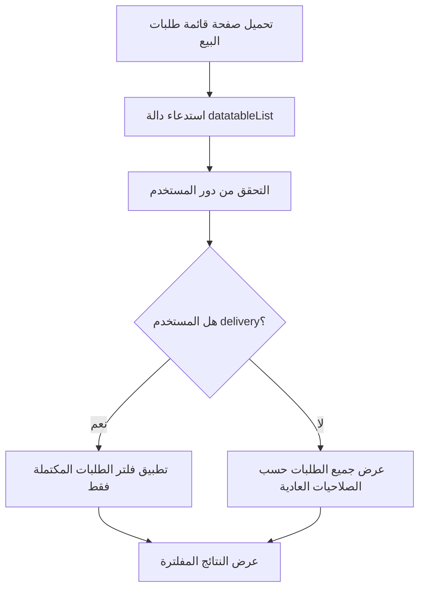

# تحليل دالة فلترة طلبات البيع للمستخدمين ذوي دور "Delivery"

## الملف المُحدّث
`app/Http/Controllers/Sale/SaleOrderController.php`

## الهدف
تحديد وصول المستخدمين ذوي دور "delivery" لعرض طلبات البيع المكتملة فقط (`order_status = 'Completed'`).

## التحليل والخطوات المُنفّذة

### 1. فهم البنية الحالية للنظام

#### أ) نموذج المستخدم والأدوار
```php
// app/Models/User.php
public function role(): BelongsTo
{
    return $this->belongsTo(Role::class, 'role_id');
}
```

#### ب) حالات طلبات البيع
```php
// app/Services/GeneralDataService.php
function getSaleOrderStatus() : array {
    return [
        ['id' => 'Pending', 'name' => 'Pending', 'color' => 'warning'],
        ['id' => 'Processing', 'name' => 'Processing', 'color' => 'primary'],
        ['id' => 'Completed', 'name' => 'Completed', 'color' => 'success'],
        ['id' => 'Delivery', 'name' => 'Delivery', 'color' => 'info'],
        ['id' => 'Cancelled', 'name' => 'Cancelled', 'color' => 'danger'],
        ['id' => 'No Status', 'name' => 'No Status', 'color' => 'secondary'],
    ];
}
```

### 2. الدوال المُضافة

#### أ) دالة التحقق من دور المستخدم
```php
/**
 * Helper method to check if current user has delivery role
 * @return bool
 */
private function isDeliveryUser(): bool
{
    $user = auth()->user();
    return $user && $user->role && strtolower($user->role->name) === 'delivery';
}
```

**الشرح:**
- تتحقق من المستخدم المُسجّل حالياً
- تتحقق من وجود دور للمستخدم
- تقارن اسم الدور مع "delivery" (غير حساسة لحالة الأحرف)

#### ب) دالة تطبيق فلتر المستخدمين المُوصِلين
```php
/**
 * Apply delivery user filtering to query
 * @param \Illuminate\Database\Eloquent\Builder $query
 * @return \Illuminate\Database\Eloquent\Builder
 */
private function applyDeliveryUserFilter($query)
{
    if ($this->isDeliveryUser()) {
        // Delivery users can only see completed orders
        $query->where('order_status', 'Completed');
    }
    return $query;
}
```

**الشرح:**
- تتحقق من كون المستخدم من دور "delivery"
- تضيف شرط `order_status = 'Delivery'` للاستعلام فقط
- ترجع الاستعلام المُعدّل

### 3. التعديل على دالة `datatableList`

#### التعديل المُضاف:
```php
->when($this->isDeliveryUser(), function ($query) {
    return $this->applyDeliveryUserFilter($query);
})
```

**المكان:** بعد الشروط الموجودة وقبل إنهاء بناء الاستعلام.

### 4. سير العمل (Workflow)



### 5. نقاط مهمة في التنفيذ

#### أ) ترتيب الشروط
تم وضع شرط "delivery" في النهاية لضمان عدم التداخل مع الشروط الأخرى.

#### ب) الحفاظ على الوظائف الموجودة
جميع الشروط الموجودة (التاريخ، المستخدم، الحفل، إلخ) تعمل بشكل طبيعي مع الشرط الجديد.

#### ج) الأمان
الفحص يتم على مستوى الخادم مما يضمن عدم تجاوز المستخدمين للقيود.

### 6. اختبار الوظيفة

#### سيناريوهات الاختبار:
1. **مستخدم بدور "delivery":** يجب أن يرى طلبات التوصيل فقط
2. **مستخدم بدور آخر:** يجب أن يرى جميع الطلبات حسب صلاحياته
3. **مستخدم بدون دور:** يجب أن يعمل النظام بشكل طبيعي

#### كيفية الاختبار:
1. إنشاء مستخدم بدور "delivery"
2. تسجيل الدخول بهذا المستخدم
3. زيارة صفحة قائمة طلبات البيع
4. التأكد من ظهور طلبات التوصيل فقط (حالة "Delivery" فقط)

### 7. ملاحظات إضافية

#### أ) قابلية التوسع
يمكن إضافة أدوار أخرى بسهولة عن طريق تعديل الدالتين المُضافتين.

#### ب) الأداء
الشرط المُضاف لا يؤثر على أداء النظام لأنه يعمل على مستوى قاعدة البيانات.

#### ج) المرونة
يمكن تخصيص الحالات المسموحة لكل دور من خلال تعديل دالة `applyDeliveryUserFilter`.

### 8. كود الملف الكامل للدوال المُضافة

```php
/**
 * Helper method to check if current user has delivery role
 * @return bool
 */
private function isDeliveryUser(): bool
{
    $user = auth()->user();
    return $user && $user->role && strtolower($user->role->name) === 'delivery';
}

/**
 * Apply delivery user filtering to query
 * @param \Illuminate\Database\Eloquent\Builder $query
 * @return \Illuminate\Database\Eloquent\Builder
 */
private function applyDeliveryUserFilter($query)
{
    if ($this->isDeliveryUser()) {
        // Delivery users can only see completed orders
        $query->where('order_status', 'Completed');
    }
    return $query;
}
```

## خلاصة
تم تنفيذ نظام فلترة آمن وفعال يقيد وصول المستخدمين ذوي دور "delivery" لعرض طلبات التوصيل فقط (حالة "Delivery" فقط)، مع الحفاظ على جميع الوظائف الموجودة في النظام.

## التحديث الجديد: إضافة حالة "Delivery"

### التغييرات المُضافة:

1. **إضافة حالة جديدة في GeneralDataService:**
```php
[
    'id'    =>  'Delivery',
    'name'    =>  'Delivery',
    'color'    =>  'info',
]
```

2. **تحديث فلتر المستخدمين المُوصِلين:**
```php
// الآن يمكن لمستخدمي التوصيل رؤية حالة التوصيل فقط:
$query->where('order_status', 'Delivery');
```

### تسلسل حالات الطلب:
1. **Pending** (في الانتظار) - لون تحذيري
2. **Processing** (قيد المعالجة) - لون أساسي
3. **Completed** (مكتمل) - لون نجاح
4. **Delivery** (قيد التوصيل) - لون معلوماتي
5. **Cancelled** (ملغي) - لون خطر
6. **No Status** (بدون حالة) - لون ثانوي

### الفوائد:
- تتبع أكثر دقة لمراحل الطلب
- إمكانية التمييز بين الطلبات المكتملة والطلبات قيد التوصيل
- تحسين workflow التوصيل
- مرونة أكبر في إدارة الطلبات
