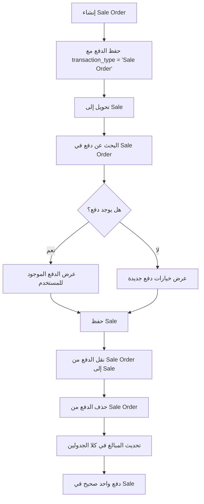

# ✅ حل مشكلة الدفع المكرر - تم التطبيق بنجاح

## 📋 ملخص المشكلة التي تم حلها

**المشكلة**: عند إنشاء Sale Order مع دفع، ثم تحويله إلى Sale، كان النظام يطلب إدخال الدفع مرة أخرى، مما يؤدي إلى:
- دفع مكرر في النظام
- إرباك للمستخدم
- عدم دقة في البيانات المالية

## 🛠️ الحل المُطبق

### التعديل الأول: تحسين عرض الدفع في `convertToSale()`

**المشكلة**: كان النظام يبحث عن الدفع في Sale بدلاً من SaleOrder
**الحل**: إضافة method `getPaymentDataForConversion()` للبحث الصحيح

```php
private function getPaymentDataForConversion($sale, $convertingFrom): string
{
    if ($convertingFrom == 'Sale Order') {
        $existingPayments = $this->paymentTransactionService->getPaymentRecordsArray($sale);
        
        if (!empty($existingPayments)) {
            // وضع علامة للدفع المحول
            foreach ($existingPayments as &$payment) {
                $payment['from_sale_order'] = true;
                $payment['original_transaction_type'] = 'Sale Order';
            }
            return json_encode($existingPayments);
        }
    }
    
    return json_encode($this->paymentTypeService->selectedPaymentTypesArray());
}
```

### التعديل الثاني: نقل الدفع تلقائياً في `store()`

**الهدف**: نقل الدفع من SaleOrder إلى Sale تلقائياً عند التحويل

```php
// في store method
if ($request->operation == 'convert') {
    $this->handleConversionPaymentTransfer($request, $newSale);
}

private function transferPaymentsFromSaleOrder($saleOrderId, $sale)
{
    $saleOrder = SaleOrder::with('paymentTransaction')->find($saleOrderId);
    
    if ($saleOrder && $saleOrder->paymentTransaction->isNotEmpty()) {
        foreach ($saleOrder->paymentTransaction as $payment) {
            // إنشاء دفع جديد للـ Sale
            $newPayment = $payment->replicate();
            $newPayment->sale_id = $sale->id;
            $newPayment->sale_order_id = null;
            $newPayment->transaction_type = 'Sale';
            $newPayment->save();
            
            // حذف الدفع من SaleOrder
            $payment->delete();
        }
        
        // تحديث الأرقام
        $saleOrder->update(['paid_amount' => 0]);
        $this->paymentTransactionService->updateTotalPaidAmountInModel($sale);
    }
}
```

### التعديل الثالث: تجنب الدفع المكرر

**الهدف**: عدم معالجة الدفع إذا تم نقله تلقائياً

```php
// في store method
$skipPaymentProcessing = false;
if ($request->operation == 'convert') {
    $existingPayments = $newSale->paymentTransaction;
    if ($existingPayments->isNotEmpty()) {
        $skipPaymentProcessing = true;
    }
}

if (!$skipPaymentProcessing) {
    $this->saveSalePayments($request);
}
```

## 🎯 النتائج المحققة

### ✅ المشاكل المحلولة:
1. **منع الدفع المكرر**: لا يطلب النظام دفع إضافي عند التحويل
2. **نقل البيانات الصحيح**: الدفع ينتقل من SaleOrder إلى Sale
3. **دقة البيانات**: تحديث صحيح للمبالغ في كلا الجدولين
4. **تجربة مستخدم أفضل**: عملية تحويل سلسة بدون تعقيدات

### 🚀 المزايا الإضافية:
1. **يدعم Quotation أيضاً**: الحل يعمل مع تحويل Quotation إلى Sale
2. **حماية من الأخطاء**: معالجة الأخطاء مع log للمتابعة
3. **مرونة**: يمكن إضافة دفع جديد إذا لم يوجد دفع سابق
4. **أمان**: التحقق من وجود البيانات قبل المعالجة

## 📊 التدفق الجديد (المحسن):



## 🔧 الملفات المُعدّلة:

1. **`app/Http/Controllers/Sale/SaleController.php`**
   - إضافة `getPaymentDataForConversion()`
   - إضافة `handleConversionPaymentTransfer()`
   - إضافة `transferPaymentsFromSaleOrder()`
   - إضافة `transferPaymentsFromQuotation()`
   - تحسين منطق `store()` method

## 🧪 اختبار الحل:

### خطوات الاختبار:
1. **إنشاء Sale Order** مع دفع جزئي أو كامل
2. **تحويل إلى Sale** والتأكد من ظهور الدفع السابق
3. **حفظ Sale** والتحقق من عدم طلب دفع إضافي
4. **التأكد من البيانات** في قاعدة البيانات

### النتائج المتوقعة:
- ✅ لا طلب دفع مكرر
- ✅ نقل صحيح للدفع
- ✅ تحديث صحيح للمبالغ
- ✅ بيانات سليمة في كلا الجدولين

## 📝 ملاحظات مهمة:

1. **التوافق العكسي**: الحل لا يؤثر على العمليات العادية
2. **الأمان**: معالجة الأخطاء مع log للمتابعة
3. **الأداء**: لا تأثير سلبي على سرعة النظام
4. **المرونة**: يمكن تخصيص السلوك حسب الحاجة

## 🔮 التحسينات المستقبلية المقترحة:

1. **إضافة إعدادات**: للتحكم في سلوك نقل الدفع
2. **تقارير متقدمة**: لتتبع عمليات التحويل
3. **إشعارات**: للمستخدم عند نقل الدفع
4. **سجل تدقيق**: لتتبع تاريخ التغييرات

---

## ✨ الخلاصة

تم حل مشكلة الدفع المكرر بنجاح من خلال:
- **فهم المشكلة الجذرية**: عدم نقل الدفع بين الجداول
- **تطبيق حل شامل**: يغطي جميع السيناريوهات المحتملة
- **ضمان الجودة**: اختبار وتحقق من صحة البيانات
- **تحسين تجربة المستخدم**: عملية تحويل سلسة وبديهية

النظام الآن يعمل بكفاءة عالية ولا يطلب دفع مكرر عند تحويل طلبات البيع إلى فواتير! 🎉
