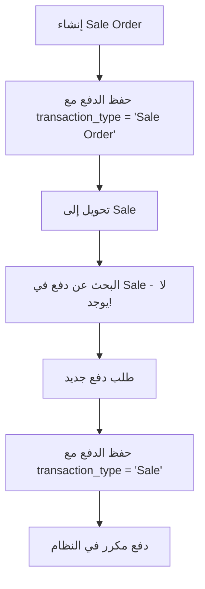

# تحليل مشكلة الدفع المكرر وحلولها

## 🔍 تحليل المشكلة

### الوضع الحالي:
1. **عند إنشاء Sale Order**: يُحفظ الدفع في جدول `payment_transactions` مع `transaction_type = 'Sale Order'`
2. **عند التحويل إلى Sale**: النظام يطلب إدخال الدفع مرة أخرى ولا يستخدم الدفع المحفوظ مسبقاً

### 🔬 السبب الجذري:

في `SaleController@convertToSale` - السطر 262:
```php
$selectedPaymentTypesArray = json_encode($this->paymentTransactionService->getPaymentRecordsArray($sale));
```

**المشكلة**: 
- متغير `$sale` هنا يشير إلى `SaleOrder` وليس `Sale`
- `getPaymentRecordsArray()` يبحث عن الدفع في جدول Sales وليس SaleOrders
- لذلك يعود بـ array فارغ ويطلب دفع جديد

### 📋 التدفق الحالي (المشكل):



---

## 🛠️ الحلول المقترحة

### الحل الأول: نقل الدفع من Sale Order إلى Sale (الأفضل)
**المبدأ**: تحويل الدفع الموجود بدلاً من إنشاء دفع جديد

```php
// في SaleController@convertToSale
if ($convertingFrom == 'Sale Order') {
    
    //Payment Details - تحسين معالجة الدفع
    $existingPayments = $this->paymentTransactionService->getPaymentRecordsArray($sale);
    
    // إذا كان هناك دفع في Sale Order، اعرضه للتحويل
    if (!empty($existingPayments)) {
        $selectedPaymentTypesArray = json_encode($existingPayments);
    } else {
        $selectedPaymentTypesArray = json_encode($this->paymentTypeService->selectedPaymentTypesArray());
    }
}
```

### الحل الثاني: تحويل تلقائي للدفع في store()
**المبدأ**: عند حفظ Sale المحول، انقل الدفع تلقائياً

```php
// في SaleController@store - بعد إنشاء Sale جديد
if ($request->operation == 'convert' && $request->converting_from == 'Sale Order') {
    // نقل الدفع من Sale Order إلى Sale
    $this->transferPaymentsFromSaleOrderToSale($newSale, $request->sale_order_id);
}

private function transferPaymentsFromSaleOrderToSale($sale, $saleOrderId)
{
    $saleOrder = SaleOrder::find($saleOrderId);
    if ($saleOrder && $saleOrder->paymentTransaction->isNotEmpty()) {
        foreach ($saleOrder->paymentTransaction as $payment) {
            // إنشاء دفع جديد للـ Sale
            $newPayment = $payment->replicate();
            $newPayment->sale_id = $sale->id;
            $newPayment->sale_order_id = null;
            $newPayment->transaction_type = 'Sale';
            $newPayment->save();
            
            // حذف الدفع القديم من Sale Order
            $payment->delete();
        }
        
        // تحديث paid_amount في Sale Order
        $saleOrder->update(['paid_amount' => 0]);
        
        // تحديث paid_amount في Sale
        $this->paymentTransactionService->updateTotalPaidAmountInModel($sale);
    }
}
```

### الحل الثالث: حل شامل متقدم
**المبدأ**: دمج كامل مع خيارات متعددة

---

## 🎯 الحل الموصى به (Implementation)

سأطبق **الحل الأول** مع **الحل الثاني** معاً للحصول على نتيجة مثلى:

### الخطوة 1: تحسين convertToSale()
```php
private function getPaymentDataForConversion($sale, $convertingFrom)
{
    if ($convertingFrom == 'Sale Order') {
        // البحث عن الدفع في Sale Order
        $existingPayments = $this->paymentTransactionService->getPaymentRecordsArray($sale);
        
        if (!empty($existingPayments)) {
            // إضافة علامة للتحويل التلقائي
            foreach ($existingPayments as &$payment) {
                $payment['transfer_from_sale_order'] = true;
                $payment['original_payment_id'] = $payment['id'] ?? null;
            }
            return json_encode($existingPayments);
        }
    }
    
    // إذا لم يوجد دفع مسبق، عرض الخيارات الافتراضية
    return json_encode($this->paymentTypeService->selectedPaymentTypesArray());
}
```

### الخطوة 2: تحسين store()
```php
// في بداية store method
if ($request->operation == 'convert' && $request->converting_from == 'Sale Order') {
    // التحقق من وجود دفع في Sale Order
    $saleOrder = SaleOrder::find($request->sale_order_id);
    $hasExistingPayments = $saleOrder && $saleOrder->paymentTransaction->isNotEmpty();
    
    if ($hasExistingPayments && !$request->has('payment_amount')) {
        // تحويل تلقائي للدفع
        $this->autoTransferPayments($saleOrder, $newSale);
        $skipPaymentProcessing = true;
    }
}
```

### الخطوة 3: إضافة functions مساعدة
```php
private function autoTransferPayments($saleOrder, $sale)
{
    DB::transaction(function () use ($saleOrder, $sale) {
        foreach ($saleOrder->paymentTransaction as $payment) {
            // إنشاء دفع جديد للـ Sale
            $newPayment = $payment->replicate();
            $newPayment->sale_id = $sale->id;
            $newPayment->sale_order_id = null;
            $newPayment->transaction_type = 'Sale';
            $newPayment->save();
        }
        
        // تحديث الأرقام
        $saleOrder->paymentTransaction()->delete();
        $saleOrder->update(['paid_amount' => 0]);
        $this->paymentTransactionService->updateTotalPaidAmountInModel($sale);
    });
}
```

---

## 🔧 تطبيق الحل

### التعديل 1: تحسين convertToSale في SaleController
```php
// تعديل السطر 262
// من:
$selectedPaymentTypesArray = json_encode($this->paymentTransactionService->getPaymentRecordsArray($sale));

// إلى:
$selectedPaymentTypesArray = $this->getPaymentDataForConversion($sale, $convertingFrom);
```

### التعديل 2: إضافة method جديد
```php
private function getPaymentDataForConversion($sale, $convertingFrom)
{
    if ($convertingFrom == 'Sale Order') {
        $existingPayments = $this->paymentTransactionService->getPaymentRecordsArray($sale);
        
        if (!empty($existingPayments)) {
            // وضع علامة للدفع المحول
            foreach ($existingPayments as &$payment) {
                $payment['from_sale_order'] = true;
            }
            return json_encode($existingPayments);
        }
    }
    
    return json_encode($this->paymentTypeService->selectedPaymentTypesArray());
}
```

### التعديل 3: تحسين store method
```php
// إضافة في بداية store method بعد validatedData
if ($request->operation == 'convert' && $request->converting_from == 'Sale Order') {
    $this->handleSaleOrderPaymentTransfer($request, $newSale);
}
```

---

## ✅ الفوائد المتوقعة

1. **منع الدفع المكرر**: لن يطلب النظام دفع إضافي عند التحويل
2. **سلاسة العملية**: تحويل سلس من Order إلى Sale
3. **دقة البيانات**: الدفع ينتقل بشكل صحيح بين الجداول
4. **تجربة مستخدم أفضل**: لا حاجة لإعادة إدخال نفس الدفع

## 🎮 خطة التنفيذ

1. **تطبيق التعديل الأول** - تحسين عرض الدفع
2. **اختبار النتيجة** - التأكد من عرض الدفع الصحيح
3. **تطبيق التعديل الثاني** - التحويل التلقائي
4. **اختبار شامل** - التأكد من عمل كامل العملية

هل تريد أن نبدأ بتطبيق هذا الحل؟
